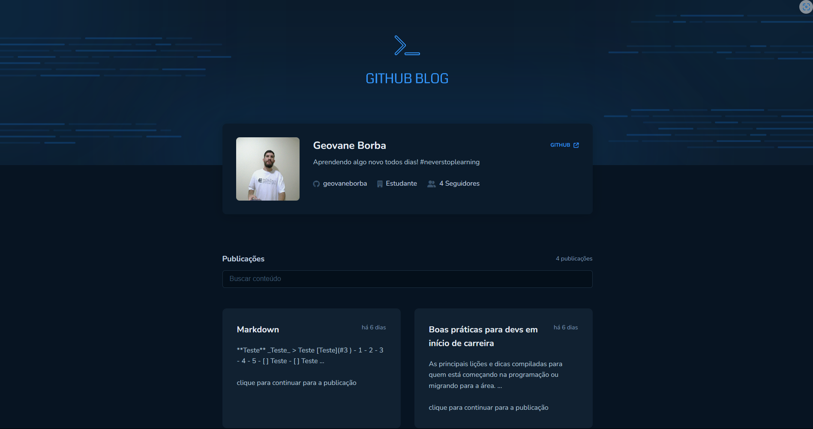

<p align="center">
  
   
  
</p>

<p align="center">
  <a href="#dart-sobre">Sobre</a> &#xa0; | &#xa0;
  <a href="#rocket-tecnologias">Tecnologias</a> &#xa0; | &#xa0;
  <a href="#warning-pré-requisitos"> Pré requisitos</a> &#xa0; | &#xa0;
  <a href="#checkered_flag-começando">Começando</a> &#xa0; | &#xa0;
  <a href="#memo-licença">Licença</a> &#xa0; | &#xa0;
  <a href="https://github.com/geovaneborba" target="_blank">Autor</a>
</p>

<br>

## :dart: Sobre

<p>
O GitHub Blog foi um desafio realizado durante o módulo de <strong>Consumo de API e performance no ReactJS</strong> que faz parte do programa de especialização Ignite da <a href='https://www.rocketseat.com.br/' target="_blank">Rocketseat</a>.

Neste desafio foi praticado a utilização de clientes HTTP consumindo a API do GitHub para criar um blog pessoal que contém as seguintes funcionalidades:

- Listagem do seu perfil com imagem, número de seguidores, nome e outras informações disponíveis pela API do GitHub.
- Listar e filtrar todas as issues do repositório com um pequeno resumo do conteúdo dela
- Criar uma página para exibir um post (issue) completo

Além disso, foi trabalhado também conceitos como:

- Fetch / Axios
- Roteamento e React Router DOM
- Formulários

</p>

<p align="right">(<a href="#top">Voltar para o topo</a>)</p>

## :rocket: Tecnologias

As seguintes tecnologias foram usadas na construção do projeto:

- [Vite](https://vitejs.dev/)
- [React](https://reactjs.org/docs/getting-started.html)
- [TypeScript](https://www.typescriptlang.org/)

<p align="right">(<a href="#top">Voltar para o topo</a>)</p>

## :warning: Pré-requisitos

Antes de começar, você precisa ter o [Git](https://git-scm.com) e o [Node](https://nodejs.org/en/) instalados em sua maquina.

<p align="right">(<a href="#top">Voltar para o topo</a>)</p>

## :checkered_flag: Começando

```bash
# Clone este repositório
$ git clone https://github.com/geovaneborba/github-blog.git

# Entre na pasta
$ cd github-blog

# Instale as dependências
$ npm install

# Para iniciar o projeto
$ npm run dev
# O app vai inicializar e será informado no terminal o endereço e porta onde estará rodando a aplicação
# geralmente é http://localhost:5173/
```

<p align="right">(<a href="#top">Voltar para o topo</a>)</p>

## :memo: Licença

Este projeto está sob licença MIT. Veja o arquivo [LICENSE](LICENSE.md) para mais detalhes.

<p align="right">(<a href="#top">Voltar para o topo</a>)</p>

<p align="center">Feito com ❤️ por <a href="https://github.com/geovaneborba" target="_blank">Geovane Borba</a></p>
